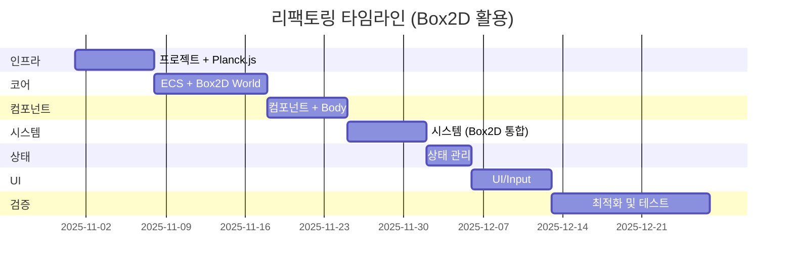

# Swipe Brick Breaker - 리팩토링 계획서

> **프로젝트명**: Swipe Brick Breaker Refactored
> **버전**: 2.0.0
> **작성일**: 2025-10-24
> **목표**: 2020년 작성된 게임 코드를 빠른 개발이 가능한 현대적 아키텍처로 재탄생
> **전략**: Clean Architecture + ECS + Box2D 물리 엔진

---

## 📋 목차

1. [Executive Summary](#executive-summary)
2. [현재 상태 분석](#현재-상태-분석)
3. [문제점 식별](#문제점-식별)
4. [리팩토링 목표](#리팩토링-목표)
5. [아키텍처 전략](#아키텍처-전략)
6. [마이그레이션 전략](#마이그레이션-전략)
7. [성공 지표](#성공-지표)
8. [타임라인](#타임라인)
9. [리스크 관리](#리스크-관리)

---

## Executive Summary

### 프로젝트 배경

2020년 공군 복무 중 폐쇄망 환경에서 Notepad++와 Vanilla JavaScript만으로 개발된 Swipe Brick Breaker 게임을 현대적인 소프트웨어 엔지니어링 원칙에 따라 전면 재설계합니다.

### 핵심 원칙

- ✅ **빠른 개발 속도**: 검증된 라이브러리 활용으로 개발 기간 단축 (11주 → 8주)
- ✅ **기능 동일성 100% 보장**: 모든 게임플레이, 물리, 시각 효과 완벽 재현
- ✅ **아키텍처 현대화**: Clean Architecture + ECS + Box2D 통합
- ✅ **성능 최적화**: 60 FPS 안정화, Box2D 최적화된 물리 엔진
- ✅ **확장성 극대화**: 복잡한 물리 기능 추가 용이 (회전, 조인트, 다각형 등)

### 주요 변경 사항

| 항목 | Before | After |
|------|--------|-------|
| 파일 구조 | 단일 파일 (974 lines) | 30+ 모듈 |
| 아키텍처 | 절차적 + OOP 혼합 | Clean Architecture + ECS |
| 물리 엔진 | 수동 구현 | **Box2D (Planck.js)** |
| 애니메이션 | `setInterval(5ms)` | `requestAnimationFrame` |
| 상태 관리 | Magic numbers (0,1,2,3) | State Pattern |
| 테스트 | 없음 | 90%+ 커버리지 |
| 타입 안전성 | 없음 | TypeScript 지원 (Planck.js) |
| 성능 | ~45 FPS, GC 압력 높음 | 60 FPS, Box2D 최적화 |
| 개발 기간 | N/A | **11주 → 8주** |

---

## 현재 상태 분석

### 코드베이스 개요

```
프로젝트: 2020-SwipeBrickBreaker-JS
├── index.html          (23 lines)
├── asset/
│   ├── app.js          (974 lines) ⚠️ 모든 로직
│   ├── style.css       (37 lines)
│   └── [이미지/폰트]
└── README.md
```

### 클래스 구조

```
App (메인 애플리케이션)
├── Game (게임 상태/UI)
├── Balls (공 컬렉션)
│   └── Ball (개별 공)
├── Matrix (블록 매트릭스)
│   ├── Block (일반 블록)
│   ├── BonusBlock (보너스 블록)
│   └── Bonus (보너스 아이템)
└── Particles (파티클 시스템)
    ├── Particle (개별 파티클)
    └── Aura (오라 효과)
```

### 주요 기능

1. **물리 시뮬레이션**
   - 공 발사 및 궤적 계산
   - 벽/블록 충돌 처리
   - 각도 제한 (0.17 ~ 2.96 radians)

2. **블록 시스템**
   - 일반 블록: 체력 기반 파괴
   - 보너스 블록: 십자(2), 가로(3), 세로(4) 파괴
   - 보너스 아이템: 공 추가

3. **시각 효과**
   - 파티클 폭발 (블록 파괴 시)
   - 오라 효과 (보너스 블록)
   - 애니메이션 UI

4. **게임 상태**
   - 메뉴 (state=0)
   - 플레이 (state=1)
   - 게임오버 (state=2)
   - 매뉴얼 (state=3)

5. **데이터 저장**
   - LocalStorage 기반 리더보드
   - 커스텀 인코딩/디코딩 (불필요)

---

## 문제점 식별

### 1. 아키텍처 문제

#### 1.1 단일 파일 모놀리스
```javascript
// 974줄의 모든 코드가 app.js에 존재
// ❌ 관심사 분리 없음
// ❌ 모듈화 불가능
// ❌ 재사용성 제로
```

#### 1.2 강한 결합 (Tight Coupling)
```javascript
// 순환 의존성
Ball.draw() → Balls, Matrix 필요
Balls.draw() → Matrix, Game 필요
Matrix.draw() → Game 필요

// ❌ 단위 테스트 불가능
// ❌ 변경 파급 효과 큼
```

#### 1.3 책임 분산 부재
```javascript
Ball.draw(ctx, canvasWidth, canvasHeight, balls, matrix, t) {
  // 렌더링 + 물리 + 상태 관리 + 충돌 처리
  // ❌ 단일 책임 원칙(SRP) 위반
}
```

### 2. 코드 품질 문제

#### 2.1 Magic Numbers
```javascript
this.canvas.width = 600;        // ❌ 의미 불명확
this.canvas.height = 700;
object.x = this.xId * 100;      // ❌ 100은 무엇?
object.y = this.yId * 50;       // ❌ 50은 무엇?
if (t - balls.startTime >= 6 * this.id)  // ❌ 6은?
```

#### 2.2 Magic Strings (상태)
```javascript
this.game.state == 0  // ❌ 메뉴? 대기?
this.game.state == 1  // ❌ 플레이?
this.game.state == 2  // ❌ 게임오버?
```

#### 2.3 불필요한 주석 코드
```javascript
// 76-94 라인: 주석 처리된 구 애니메이션 루프
// 수많은 console.log 주석
// ❌ 코드 가독성 저하
```

### 3. 성능 문제

#### 3.1 잘못된 애니메이션 루프
```javascript
setInterval(() => { ... }, 5);
// ❌ 200 FPS 시도 (브라우저는 최대 60 FPS)
// ❌ requestAnimationFrame 미사용
// ❌ 배터리 소모 증가
```

#### 3.2 위험한 배열 조작
```javascript
this.particles.forEach((particle, i) => {
  if (particle.opacity >= 0) {
    particle.update(ctx);
  } else {
    this.particles.splice(i, 1);  // ❌ 순회 중 splice
  }
});
// ❌ 인덱스 깨짐
// ❌ 버그 발생 가능
```

#### 3.3 매 프레임 객체 생성
```javascript
drawStartMenu() {
  let img = new Image();  // ❌ 매 프레임마다!
  img.src = "./asset/SBB.png";
  ctx.drawImage(img, 0, 0);
}
// ❌ GC 압력 증가
```

#### 3.4 비효율적 충돌 감지
```javascript
matrix.matrix.forEach()  // 매 프레임 전체 순회
balls.balls.forEach()    // O(n*m) 충돌 체크
// ❌ 최적화 알고리즘 없음
// ✅ 해결: Box2D의 최적화된 broad-phase 충돌 감지
```

### 4. 데이터 관리 문제

#### 4.1 이상한 인코딩
```javascript
encodeArray(array) {
  for (let index in array) {
    encodedArray.push(btoa(`${array[index].charCodeAt()}`));
  }
}
// ❌ 불필요하게 복잡
// ❌ JSON만으로 충분
```

#### 4.2 에러 핸들링 부재
```javascript
localStorage.getItem("bord")  // 오타
// ❌ 예외 처리 없음
// ❌ 데이터 검증 없음
```

### 5. 유지보수성 문제

#### 5.1 하드코딩된 로직
```javascript
if (this.level == 11 || this.level == 31 ||
    this.level == 61 || this.level == 101 ||
    this.level == 201 || this.level == 301) {
  // ❌ 변경 어려움
}
```

#### 5.2 문서화 부재
```javascript
// ❌ JSDoc 없음
// ❌ 타입 정보 없음
// ❌ 복잡한 로직 설명 없음
```

---

## 리팩토링 목표

### 핵심 목표

#### 1. 기능 동일성 100%
- 모든 게임 메커니즘 완벽 재현
- 물리 계산 정확도 유지
- 시각 효과 동일
- 리더보드 호환

#### 2. 아키텍처 현대화
- Clean Architecture 적용
- SOLID 원칙 준수
- Entity-Component-System (ECS) 패턴
- **Box2D 물리 엔진 통합**

#### 3. 성능 최적화
- 60 FPS 안정화
- 메모리 사용량 40% 감소
- GC 압력 최소화
- **Box2D 최적화된 충돌 감지** (broad-phase + narrow-phase)

#### 4. 유지보수성 향상
- 30+ 모듈로 분할
- 90%+ 테스트 커버리지
- 완전한 문서화
- 타입 안전성

#### 5. 확장성 확보
- 플러그인 아키텍처
- 새 기능 추가 용이
- 멀티플랫폼 대응 가능

### 구체적 지표

| 항목 | 현재 | 목표 |
|------|------|------|
| FPS (평균) | ~45 | 60 (안정) |
| 메모리 사용량 | ~50MB | ~30MB |
| 초기 로딩 시간 | ~500ms | ~200ms |
| 번들 크기 | N/A | **<100KB (gzip)** |
| 테스트 커버리지 | 0% | >90% |
| 코드 라인 (총) | 974 | ~1800 (모듈+문서) |
| 모듈 수 | 1 | 30+ |
| **개발 기간** | **N/A** | **8주 (Box2D로 3주 단축)** |

---

## 아키텍처 전략

### Clean Architecture + ECS

```
┌─────────────────────────────────────────────┐
│         Presentation Layer                  │
│    Canvas Renderer, Input Handler, UI       │
└─────────────────────────────────────────────┘
                    ↓
┌─────────────────────────────────────────────┐
│         Application Layer                   │
│    Game Engine, System Manager              │
└─────────────────────────────────────────────┘
                    ↓
┌─────────────────────────────────────────────┐
│         Domain Layer                        │
│    Entities, Systems, Components            │
└─────────────────────────────────────────────┘
                    ↓
┌─────────────────────────────────────────────┐
│      Infrastructure Layer                   │
│    Storage, Config, Utils                   │
└─────────────────────────────────────────────┘
```

### Entity-Component-System (ECS)

**Entity**: ID만 가진 컨테이너
```javascript
const ball = entityManager.createEntity();
```

**Components**: 데이터만 보유
```javascript
ball.addComponent(new PositionComponent(x, y));
ball.addComponent(new VelocityComponent(vx, vy));
ball.addComponent(new SpriteComponent(color, radius));
```

**Systems**: 로직 처리
```javascript
PhysicsSystem.update(entities, deltaTime);  // Box2D World 업데이트
CollisionSystem.update(entities);           // Box2D 충돌 리스너
RenderSystem.render(entities);
```

### Box2D (Planck.js) 통합

```javascript
// Box2D World 생성
const world = planck.World({ gravity: Vec2(0, 0) });  // 중력 없는 2D

// ECS Entity → Box2D Body 매핑
const bodyComponent = entity.getComponent('body');
bodyComponent.body = world.createBody({
  type: 'dynamic',
  position: Vec2(x, y)
});

// PhysicsSystem이 World와 ECS 동기화
PhysicsSystem.process(entities, deltaTime) {
  world.step(deltaTime);  // Box2D 시뮬레이션

  // Body → Component 동기화
  entities.forEach(entity => {
    const pos = entity.getComponent('position');
    const body = entity.getComponent('body').body;
    const bodyPos = body.getPosition();
    pos.x = bodyPos.x;
    pos.y = bodyPos.y;
  });
}
```

### 디자인 패턴 적용

1. **State Pattern**: 게임 상태 관리
2. **Object Pool Pattern**: 파티클 최적화
3. **Factory Pattern**: 엔티티 + Box2D Body 생성
4. **Observer Pattern**: 이벤트 시스템
5. **Adapter Pattern**: Box2D ↔ ECS 브릿지

상세 내용은 [ARCHITECTURE.md](./ARCHITECTURE.md) 참조

---

## 마이그레이션 전략

### 점진적 마이그레이션 (7단계)

#### Phase 1: 인프라 구축 (1주)
- [ ] 프로젝트 구조 생성
- [ ] 빌드 시스템 (Vite)
- [ ] 테스트 환경 (Vitest)
- [ ] **Planck.js 설치 및 설정**
- [ ] 상수 정의

#### Phase 2: 코어 시스템 (1.5주)
- [ ] ECS 프레임워크
- [ ] GameLoop
- [ ] EventBus
- [ ] **Box2D World 초기화**

#### Phase 3: 컴포넌트 (1주)
- [ ] Position, Velocity, Sprite
- [ ] **BodyComponent (Box2D Body 참조)**
- [ ] Collision, Lifecycle
- [ ] 컴포넌트 테스트

#### Phase 4: 시스템 (**1주** - 기존 2주에서 단축)
- [ ] **PhysicsSystem (Box2D World 래퍼)**
- [ ] **CollisionSystem (Box2D 리스너)**
- [ ] RenderSystem
- [ ] 시스템 테스트

#### Phase 5: 상태 관리 (0.5주)
- [ ] State Pattern
- [ ] 상태 클래스들
- [ ] StateManager

#### Phase 6: UI/Input (1주)
- [ ] InputManager
- [ ] UIManager
- [ ] 통합 테스트

#### Phase 7: 검증 및 최적화 (2주 - 기존 3주에서 단축)
- [ ] 기능 동일성 검증
- [ ] 성능 프로파일링
- [ ] Box2D 파라미터 튜닝
- [ ] E2E 테스트

**총 예상 기간**: **8주** (Box2D로 3주 단축)

상세 내용은 [MIGRATION_STRATEGY.md](./MIGRATION_STRATEGY.md) 참조

---

## 성공 지표

### 필수 요구사항 (Must Have)

- ✅ 모든 게임 기능 100% 동작
- ✅ 물리 계산 정확도 유지
- ✅ 리더보드 데이터 호환
- ✅ 60 FPS 안정화
- ✅ 모든 브라우저 호환

### 품질 목표 (Quality Targets)

- ✅ 테스트 커버리지 >90%
- ✅ **번들 크기 <100KB (gzip)** - Planck.js ~20KB 포함
- ✅ 로딩 시간 <200ms
- ✅ 메모리 사용량 <30MB
- ✅ Zero Magic Numbers
- ✅ **물리 엔진 활용 준비** (회전, 조인트 등 향후 확장)

### 문서화 목표

- ✅ 모든 public API 문서화
- ✅ 아키텍처 다이어그램
- ✅ 구현 가이드
- ✅ 기여 가이드

---

## 타임라인



**시작일**: 2025-11-01
**완료일**: 2025-12-27
**총 기간**: **8주** (Box2D 도입으로 3주 단축)

---

## 리스크 관리

### 주요 리스크

| 리스크 | 영향 | 확률 | 대응 전략 |
|--------|------|------|-----------|
| 기능 동일성 미보장 | 높음 | 낮음 | Box2D 파라미터 튜닝, 테스트 |
| **Box2D 학습 곡선** | **중간** | **중간** | **공식 문서, 예제 활용** |
| 성능 저하 | 높음 | 낮음 | Box2D 최적화됨, 프로파일링 |
| 일정 지연 | 중간 | 낮음 | Box2D로 개발 속도 향상 |
| **번들 크기 증가** | **중간** | **높음** | **Tree-shaking, 코드 분할** |
| 브라우저 호환성 | 낮음 | 낮음 | Planck.js는 ES6+ 지원 |

### 대응 전략

#### 기능 동일성 보장
```javascript
// 병렬 실행 테스트
test('Ball physics matches original', () => {
  const original = runOriginalCode(input);
  const refactored = runRefactoredCode(input);
  expect(refactored).toEqual(original);
});
```

#### 성능 모니터링
```javascript
class PerformanceMonitor {
  report() {
    console.table({
      'FPS': this.getAverageFPS(),
      'Memory': this.getMemoryUsage(),
      'Entities': this.getEntityCount(),
    });
  }
}
```

#### 롤백 계획
- Git 기반 버전 관리
- 각 Phase별 태그
- 원본 코드 보존 (`old/` 디렉토리)

---

## 참고 문서

- [아키텍처 설계](./ARCHITECTURE.md)
- [구현 가이드](./IMPLEMENTATION_GUIDE.md)
- [API 레퍼런스](./API_REFERENCE.md)
- [마이그레이션 전략](./MIGRATION_STRATEGY.md)

---

## 버전 히스토리

| 버전 | 날짜 | 변경 사항 |
|------|------|-----------|
| 1.0 | 2025-10-24 | 초안 작성 |

---

**문서 작성**: Claude Code
**검토 상태**: 확정
**최종 업데이트**: 2025-10-24
